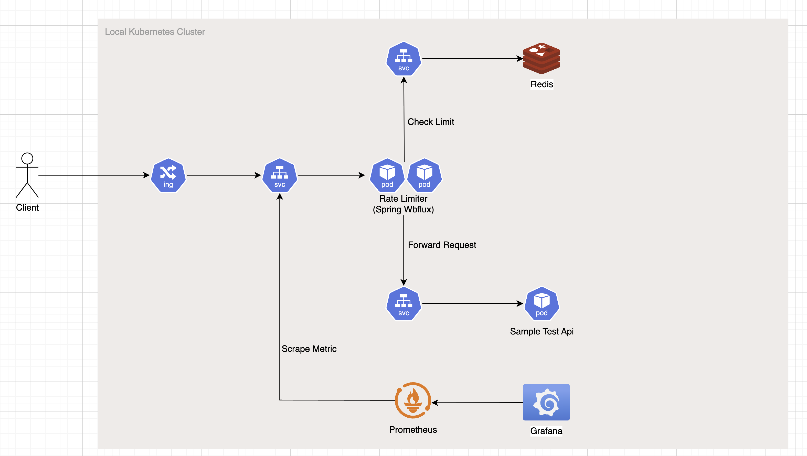
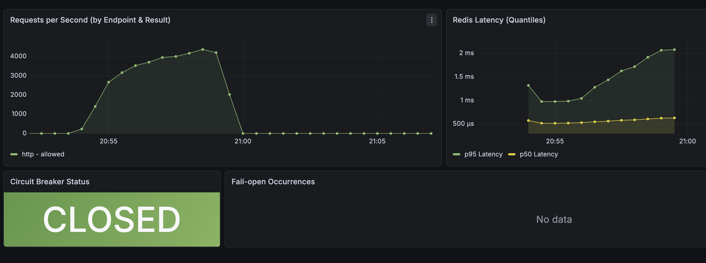
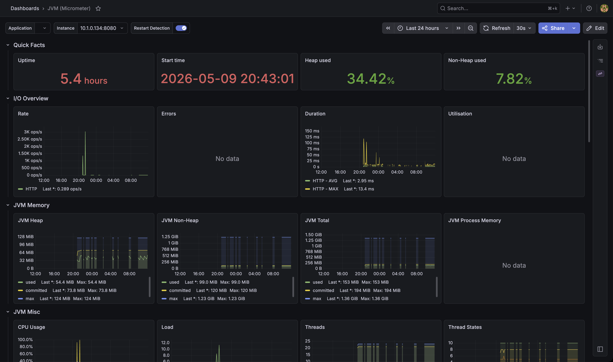

# Redis Lua와 WebFlux 기반의 처리율 제한 장치 (Rate Limiter)

분산 환경에서 원자성을 보장하고, 고가용성(Fail-Open)과 정교한 관측 가능성(Observability)을 제공하는 처리율 제한 장치입니다.

## 🚀 핵심 설계 (Core Values)
- **Atomic Operations:** Redis Lua 스크립트를 통한 Race Condition 해결 및 데이터 정합성 보장.
- **High Availability:** Resilience4j Circuit Breaker 기반의 Fail-Open 전략으로 장애 전파 방지.
- **Performance:** WebFlux 기반 비동기 처리.
- **Cloud-Native & Observability:** Kubernetes 배포 및 Prometheus/Grafana 모니터링 체계 구축.

## 🛠 기술 스택 (Tech Stack)
- **Language:** Kotlin 2.2.21, Java 21
- **Framework:** Spring Boot 4.0.5 (WebFlux)
- **Data & Resilience:** Redis, Resilience4j 2.2.0
- **Infra & Testing:** Kubernetes, Prometheus, Grafana, nGrinder

## 🏛 시스템 아키텍처 (System Architecture)

### 1. Atomic Operations with Redis Lua
분산 환경에서 여러 인스턴스가 동일한 키의 카운터를 조작할 때 발생하는 **Check-then-Set** 문제를 해결하기 위해 Lua 스크립트를 사용합니다.
- 모든 연산은 Redis 내부에서 원자적으로 실행되어 데이터 정합성을 보장합니다.
- 스크립트 실행 중 Redis 서버 시간(`TIME`)을 참조하여 클라이언트 간 시간 동기화 문제를 제거했습니다.

### 2. Resilience Design: Fail-Open Strategy
Redis 장애가 서비스 전체의 장애(Single Point of Failure)가 되지 않도록 **Resilience4j Circuit Breaker**를 적용했습니다.
- Redis 지연 시간(Timeout) 및 연결 오류 발생 시 자동으로 **Fail-Open** 상태로 전환됩니다.
- 가용성을 위해 차단(Blocking)보다 통과(Passing)를 우선시하는 정책을 채택했습니다.

## 📊 성능 분석 및 결과 (Performance Analysis)
nGrinder를 사용하여 로컬 Kubernetes 환경에서 시스템 한계 성능을 측정했습니다. 상세한 분석 내용은 [부하테스트 분석 리포트](docs/features/step8-ngrinder-test/result.md)에서 확인할 수 있습니다.

### 💻 Test Environment (Pod Specs)
- **rate-limiter**: CPU Request 0.5 / Limit 1.0, Memory 512Mi (Fixed)
- **redis**: CPU Request 0.5 / Limit 1.0, Memory Request 256Mi / Limit 512Mi

### 📈 Metrics & Results
- **Peak TPS:** 5,492 (2 Replicas 환경)
- **Redis Latency:** p50 기준 0.5ms 미만, p95 기준 2ms 수준 유지
- **Scalability:** Pod 1개 대비 2개 증설 시 **60%의 성능 향상** 확인
- **Bottleneck:** 분석 결과 CPU-Bound 특성을 보이며, Pod 개수 증가를 통한 수평 확장이 가장 효율적인 전략임을 도출했습니다.

## 📈 관측 가능성 (Observability)
Micrometer와 Prometheus를 연동하여 실시간 지표를 수집합니다.
- **Grafana Dashboards:** TPS, Circuit Breaker Status, JVM Metrics 등을 실시간 모니터링.

### 🖼️ Dashboard Visualization
|                                            시스템 처리율 및 지연 시간                                             | JVM 리소스 모니터링 |
|:------------------------------------------------------------------------------------------------------:| :---: |
|  |  |
|                                        *<시스템 TPS, Redis 지연 시간>*                                        | *<JVM Heap, CPU 사용량 및 가비지 컬렉션 지표>* |

## 🛠 로컬 실행 가이드 (Local Setup & Running)
1. Redis 실행: `docker-compose up -d redis`
2. Test API 실행: `./test-api/gradlew bootRun`
3. Rate Limiter 실행: `./rate-limiter/gradlew bootRun`

## 📂 프로젝트 구조 (Project Structure)
- `rate-limiter/`: WebFlux 기반 게이트웨이 및 처리율 제한 로직
- `test-api/`: 테스트용 백엔드 API
- `k8s/`: Kubernetes 배포 매니페스트 (Deployment, Service, ConfigMap)
- `docs/`: 상세 설계 및 부하 테스트 리포트

