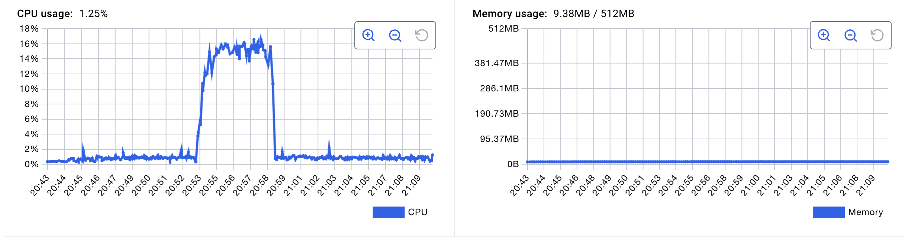
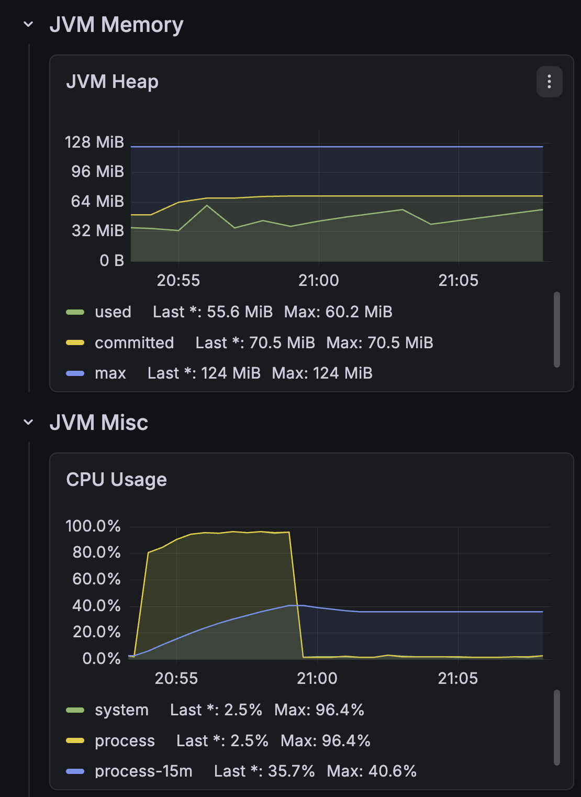

# [부하테스트 분석] 처리율 제한 장치(Rate Limiter) 부하 테스트 및 한계 성능 측정

## 1. 테스트 목적 및 배경
- 본 테스트는 구현된 처리율 제한 장치(Rate Limiter)의 **최대 처리 성능(Throughput)**과 **안정성(Reliability)**을 정량적으로 검증하기 위해 수행되었습니다.
- 특히 가용 자원 변화(Pod 수의 증감)에 따른 성능 변화를 분석하여 시스템의 **선형적 확장성(Linear Scalability)**과 **리소스 병목 지점**을 파악하는 데 중점을 두었습니다.

## 2. 테스트 환경 및 설정
- **Infrastructure**: Local Kubernetes (Docker Desktop)
- **Target Application**: 
  - `rate-limiter`: Spring WebFlux 기반 비동기 게이트웨이
  - `test-api`: 백엔드 모의 서비스
- **Data Store**: Redis (Single Instance, Sliding Window 알고리즘 실행)
- **Pod Specifications**:
  - `rate-limiter`: CPU Request 0.5 / Limit 1.0, Memory 512Mi (Fixed)
  - `redis`: CPU Request 0.5 / Limit 1.0, Memory Request 256Mi / Limit 512Mi
- **Load Tool**: nGrinder (Agent 2개, Vuser 30명, Ramp-up 적용)
- **Configuration**: 정확한 한계 성능 측정을 위해 Rate Limit 임계치를 비활성화 수준(1,000,000 req/min)으로 설정

---

## 3. 핵심 성능 지표 (Key Performance Indicators)

Pod 수의 변화에 따른 성능 데이터를 비교 분석한 결과, 시스템 자원 확장에 따른 유의미한 성능 향상을 확인하였습니다.

| Metric | 2 Replicas (Distributed) | 1 Replica (Single) | Variance |
| :--- | :--- | :--- | :--- |
| **Peak TPS** | **5,492** | 3,432 | **+60.0%** |
| **Average TPS** | **3,474.6** | 2,694.9 | **+28.9%** |
| **Mean Test Time (MTT)** | **4.64 ms** | 6.09 ms | **-23.8%** |
| **Error Rate** | 0% | 0% | - |

---

## 4. 기술적 지표 상세 분석 (Pod 2개 기준)

본 섹션은 시스템의 **수평 확장성(Horizontal Scalability)** 및 **분산 처리 효율**을 검증하기 위해, Pod 2개(Distributed) 환경에서 수집된 지표를 상세 분석합니다.

### ① 처리량 및 데이터 저장소 지연 시간 (Throughput & Redis Latency)
부하 증가에 따른 TPS의 선형적 상승 구간을 확인하였으며, 분산 카운팅을 담당하는 Redis의 응답 시간이 고부하 상태에서도 안정적으로 유지됨을 입증하였습니다.

> *<그림 1. 시스템 처리량 및 Redis Latency 추이>*

- **Throughput**: Peak 시 초당 5,400건 이상의 요청을 처리하며 높은 처리 성능을 유지함.
- **Redis Latency**: p50 기준 0.5ms 미만, p95 기준 2ms 수준으로 유지됨. Lua 스크립트를 통한 원자적 연산이 시스템 전체 성능에 미치는 오버헤드가 매우 적음을 시사함.

### ② 데이터 저장소 리소스 효율성 (Redis Resource Usage)
고부하 상황에서도 Redis의 자원 사용량은 매우 낮은 수준으로 유지되어, 알고리즘의 메모리 및 연산 효율성을 확인하였습니다.

> *<그림 2. Redis CPU 및 Memory 사용량 지표>*

- **CPU Utilization**: 최대 16~18% 수준으로, 현재 트래픽 규모의 수 배 이상을 수용할 수 있는 컴퓨팅 여력을 보유함.
- **Memory Footprint**: 약 9.38MB 수준의 일정한 사용량을 유지함.

### ③ 애플리케이션 리소스 포화도 (JVM & CPU Saturation)
개별 파드별 리소스 소모 패턴을 모니터링하여 시스템의 주 병목 지점이 CPU 자원임을 확인하였습니다.

| Pod 1 리소스 상태 | Pod 2 리소스 상태 |
| :---: | :---: |
|  |  |
| *<그림 3. Pod 1 리소스 모니터링>* | *<그림 4. Pod 2 리소스 모니터링>* |

- **CPU Saturation**: 두 파드 모두 95% 이상의 CPU 사용률을 기록함. 이는 시스템 성능의 결정적 요인이 **애플리케이션 계층의 컴퓨팅 파워**에 있음을 나타냄.
- **Load Balancing**: 각 파드의 자원 소모량이 균등하게 유지되어, Kubernetes Service를 통한 트래픽 분산이 최적화되어 있음을 확인됨.

---

## 5. 결론

1. **알고리즘 적합성 검증**: Redis Lua 스크립트를 활용한 이동 윈도우 알고리즘은 분산 환경에서 데이터 정합성을 보장함과 동시에, 초당 5,000건 이상의 고부하를 성공적으로 처리하는 고성능을 보여주었습니다.
2. **비선형적 확장성 분석**: Pod 수를 2배로 확장했을 때 TPS가 약 1.6배(60%) 증가하였습니다. 이는 로컬 인프라의 물리적 CPU 공유 및 컨텍스트 스위칭 비용으로 인한 손실로 판단되며, 클라우드 환경의 다중 노드 배포 시 더욱 높은 확장 효율을 기대할 수 있습니다.
3. **병목 구간 식별 및 최적화 전략**: 본 시스템은 **CPU-Bound** 특성을 가집니다. 따라서 향후 성능 확장 시 Redis의 스케일업보다는 **애플리케이션 파드의 수평 확장(HPA, Horizontal Pod Autoscaler)**을 우선적인 전략으로 채택하는 것이 가장 비용 효율적임을 도출하였습니다.

---

## 6. 부록 (Appendix)
- [상세 부하 테스트 리포트 - Pod 2개 (PDF)](./result/rate-limiter-ngrinder-load-test.pdf)
- [상세 부하 테스트 리포트 - Pod 1개 (PDF)](./result/rate-limiter-pod-1-ngrinder-load-test.pdf)
- [nGrinder 테스트 스크립트 (Groovy)](./TestRunner.groovy)

---
**테스트 일자**: 2026-05-09
